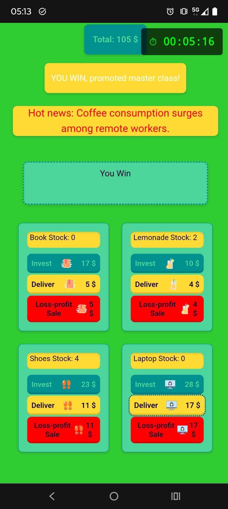
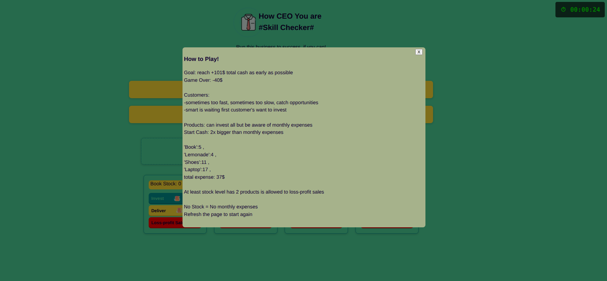
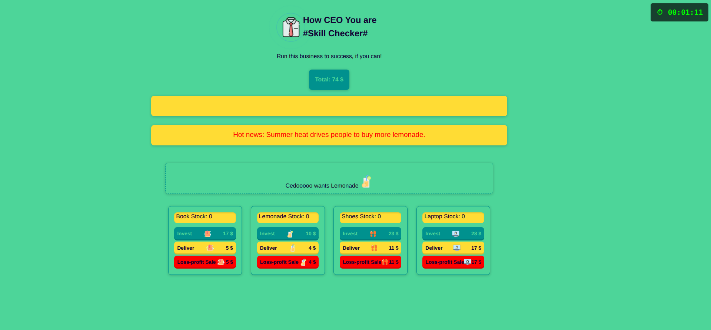
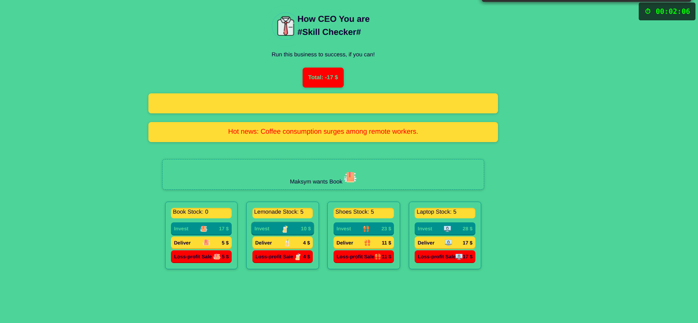
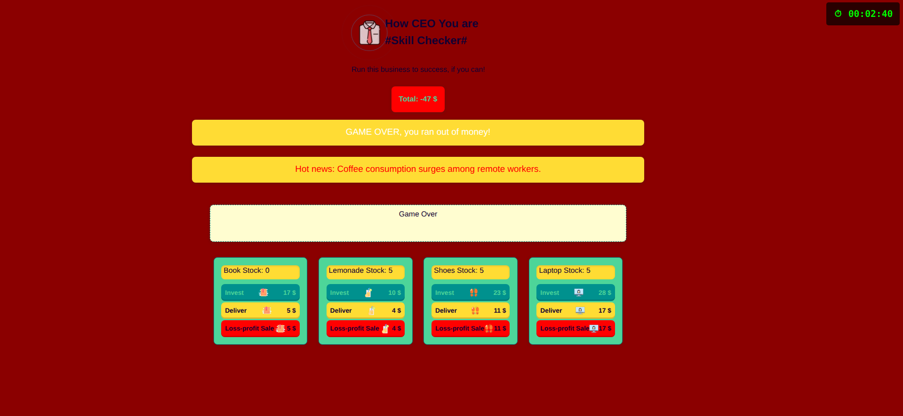

#### PowerCoders Personal Project

A browser-based game where you run a small business, make investments, serve randomized customers, and manage financial turns like in real life. Find the link below!

Too long README let me [game on](https://small-business-simulation-model.netlify.app/)

### Game Screenshots

### Mini Business Simulation Game

##### How to Play!
      - Goal: reach +81$ total cash as early as possible
      - Game Over: -80$
      
      - Customers: 
        - sometimes too fast, sometimes too slow, catch opportunities
        - smart is waiting first customer's want to invest
      
      - Products: can invest all but be aware of monthly expenses
        - 'Book':5 ,
        - 'Lemonade':4 ,
        - 'Shoes':11 ,
        - 'Laptop':17 ,
        **total expense: 37$**
      
      - Start Cash: 2x bigger than monthly expenses
    
      - No Stock = No monthly expenses

      - Refresh the page to start again

This simulation scales; 
if you take care of each customer,
if you enough smart to invest in profitable and sustainable product.

You shouldn't invest all products simultaneously,
if you dont have enough capital to pay expenses monthly

## What I plan to do

Timing record with a mock user name can be added to list winners

Can save the players current state(total cash)

Add a pause button

## License

This project is licensed under the [MIT](./license) License.